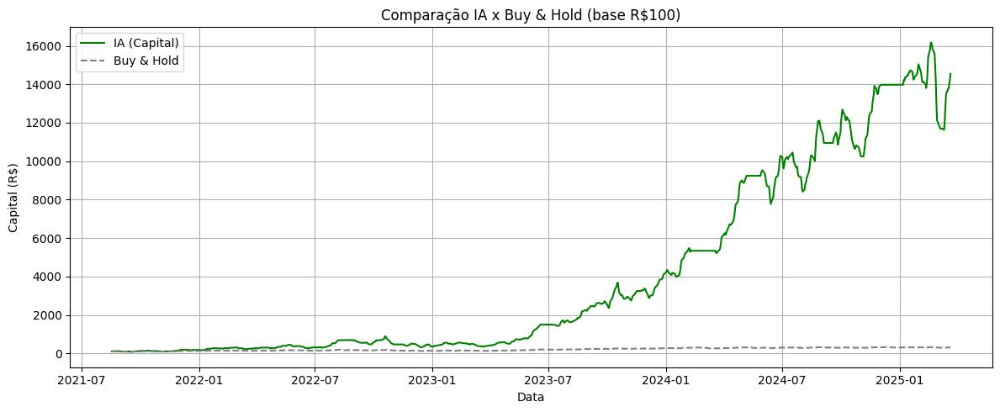

## 📊 Rede Neural para Previsão de Tendência com Estratégia de Simulação de Capital


Este projeto aplica machine learning com redes neurais para prever a direção futura de ativos da bolsa de valores brasileira (como BOVA11 e PETR4), incorporando indicadores técnicos clássicos, ajustes com Keras Tuner, e uma simulação de estratégia de investimento com curva de capital, comparação com buy & hold, e avaliação completa da performance histórica.

---

## ⚙️ Tecnologias Utilizadas
- Python 3.9
- TensorFlow + Keras
- Keras Tuner
- scikit-learn
- pandas, numpy, matplotlib, seaborn
- TA-Lib (via `ta`) para indicadores técnicos
- SHAP para interpretação dos modelos
- yFinance para coleta de dados históricos de ativos

---

## 🔍 Objetivo

Treinar e otimizar uma rede neural densa (MLP) capaz de prever se o preço de um ativo estará maior ou menor após 3 dias, utilizando uma combinação de:

- Indicadores técnicos como RSI, MACD, OBV, Bandas de Bollinger
- Lags de retorno e preço, fornecendo contexto histórico ao modelo
- Otimização de hiperparâmetros via Keras Tuner
- Simulação de estratégia com capital real
- Comparação com buy & hold
- Interpretação com SHAP para entender as decisões da IA

---

## 🧠 Estrutura do Projeto

| Bloco | Título | Descrição |
|-------|--------|------------|
| 1️⃣ | 📥 Coleta de Dados + Indicadores Técnicos | Usa yfinance para importar preços históricos e calcula indicadores com `ta` |
| 2️⃣ | ⚙️ Engenharia de Features | Criação dos lags, normalização com MinMaxScaler, preparação de `X` e `y` |
| 3️⃣ | 🔄 Split Treino/Teste | Separação dos dados respeitando ordem temporal (sem shuffle) |
| 4️⃣ | 🧠 Construção da Rede Neural | Modelo com Keras, ativação relu, saída sigmoid, float16 (mixed_precision), e tuning com Keras Tuner |
| 5️⃣ | 💾 Salvamento de Modelos | Automatiza o salvamento dos melhores modelos (.h5) e hiperparâmetros (.txt) |
| 6️⃣ | 📊 Avaliação do Modelo | Inclui classification report, métricas como acurácia, F1, recall, precisão, e matriz de confusão explicada |
| 7️⃣ | 💸 Simulação da Estratégia | Aplica a previsão em backtest com R$100, registrando curva de capital realista |
| 8️⃣ | 📋 Análise de Performance | Gera estatísticas como rentabilidade total, anualizada, drawdown e taxa de acerto |
| 9️⃣ | 🔍 Interpretação com SHAP | Mostra quais variáveis influenciaram cada decisão da IA (local e globalmente) |
| 🔟 | 🧠 Carregamento Automático do Melhor Modelo | Função para recuperar e reavaliar os modelos com maior score |

---

## 🧪 Como Rodar o Projeto

```bash
# Clone o repositório
git clone https://github.com/gabriellima878/ia_neural_trading.git
cd seu-repositorio

# Instale as dependências
pip install -r requirements.txt

# Use o Python 3.9.19 (ou crie um ambiente com pyenv)
pyenv local 3.9.19

# Execute o notebook principal
jupyter notebook nn3.ipynb
```

---

## 📈 Exemplo de Resultado (Rede Neural vs. Buy & Hold)

📈 Exemplo de Resultado (Rede Neural vs. Buy & Hold)



---

## 🧠 Detalhes Técnicos
- Mixed Precision ativado para explorar o desempenho do Apple Silicon (M1 Pro)
- Batch Size de 64 ajustado para ganho de performance
- EarlyStopping configurado para evitar overfitting
- Hiperparâmetros otimizados: número de camadas, neurônios por camada, dropout, learning rate

---

## 📂 Estrutura de Diretórios

```
.
├── ia_tuning/
│   └── modelos/            # Modelos salvos com timestamp e score
├── nn3.ipynb               # Notebook principal do projeto
├── requirements.txt        # Bibliotecas necessárias
├── .python-version         # Versão do Python usada (pyenv)
├── .gitignore              # Arquivos ignorados pelo Git
└── README.md               # Este arquivo
```

---

## 🔒 Licença

Este projeto é de uso pessoal e educacional, focado em aprendizado e validação de estratégias com IA no mercado financeiro.

---

## ✉️ Contato

Desenvolvido por Gabriel Pereira Lima César de Oliveira – Especialista em investimentos.

- 👔 [LinkedIn](https://www.linkedin.com/in/gabriel-pereira-lima/)
- 📸 [Instagram](https://www.instagram.com/cga.gabriellima/)

Se quiser trocar uma ideia sobre IA, finanças ou investimentos, me chama!

